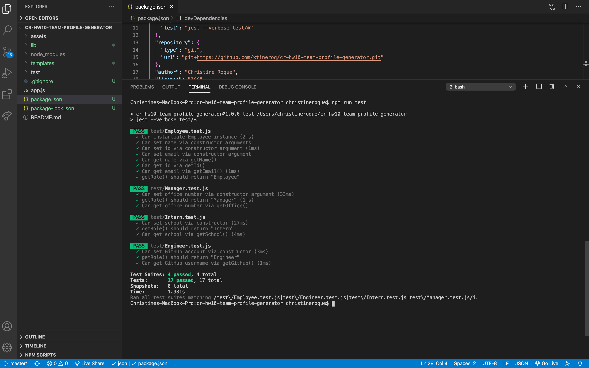
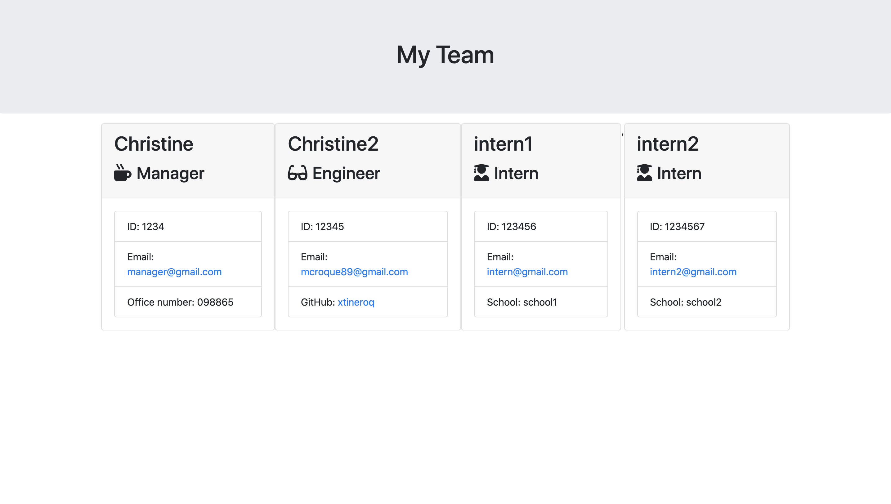

  
  
  
  [](https://github.com/xtineroq?tab=followers)
  
  # Team Profile Generator

  ## Description
  ➤ A Node CLI application that takes in information about employees and generates an HTML webpage that displays summaries for each person.

  ## Table of Contents
  * [Installation](#installation)
  * [Usage](#usage)
  * [License](#license)
  * [Contributing](#contributing)
  * [Tests](#tests)
  * [Questions](#questions)
  * [Video Link](#video-link)
  * [Screenshots](#screenshots)

  ## Installation
  ```
  Please install npm locally then run node app.js to start the application.
  ```
  
  ## Usage
  ➤ This can be used to easily generate a profile with information of your engineering team. Your engineering team may consists of a manager, and any number of engineers and interns.

  ## License
  This app is covered under the following license/s:

  

  ## Contributing
  ➤ Please send an email to the author for information about contribution guidelines.

  ## Tests
  ```
  This application was tested using jest. Please run 'npm run test'
  ```

  ## Questions
  Please direct all questions to:

  👤 https://github.com/xtineroq

  📧 mcroque89@gmail.com
  
  ## Video Link
  [Walkthrough Video](https://www.loom.com/share/611d52552a3c4674b7538393767058a8)

  ## Screenshots
  Passed Tests
  

  Sample of generated HTML page
  